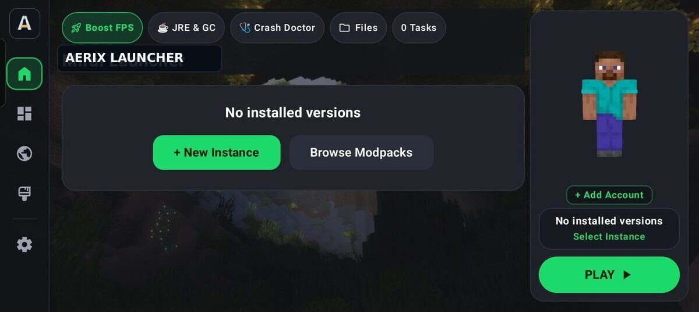
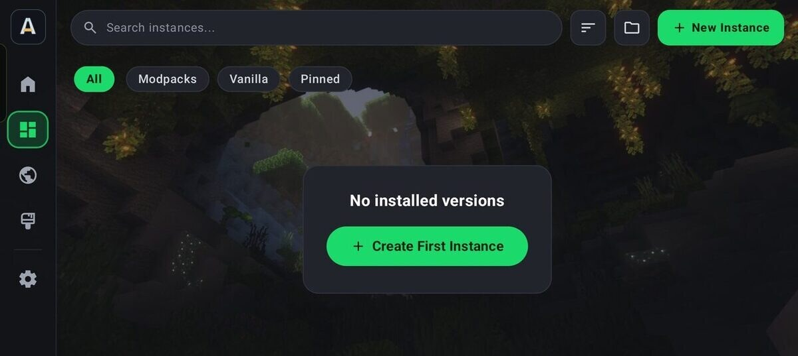
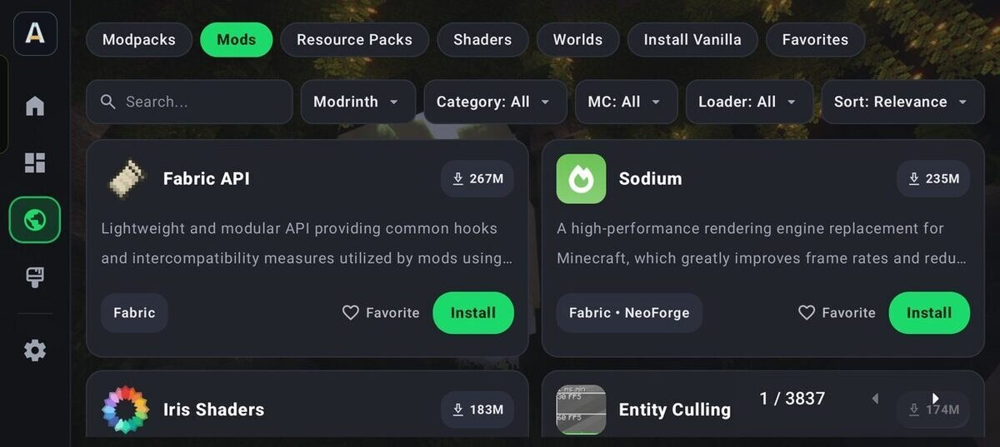
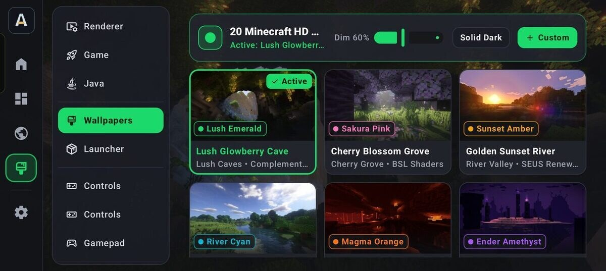
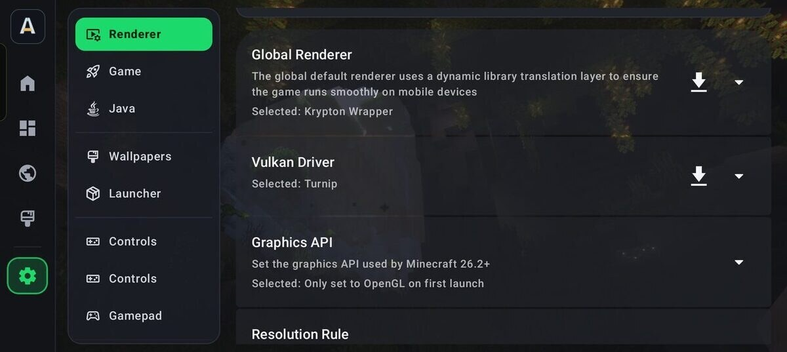
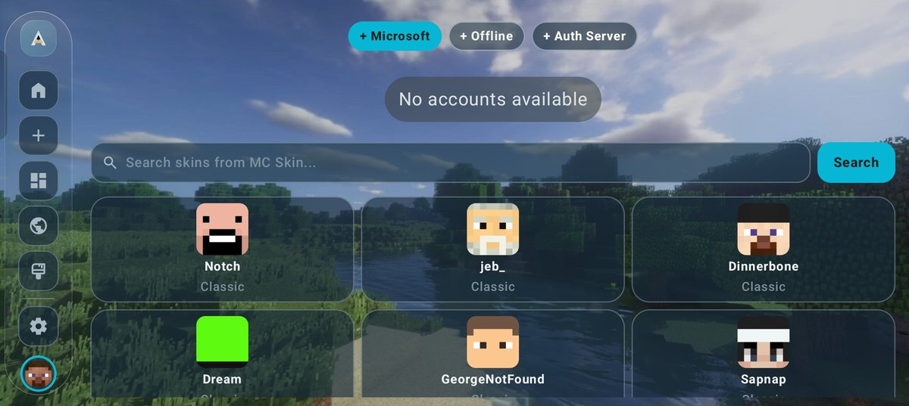

# ✨ 🚀 AERIX LAUNCHER
### Minecraft: Java Edition on Android

**Hand-built. Privately kept. Tested on real phones. Maintained by its owners.**

▶ Play &nbsp;·&nbsp; 🔍 Discover &nbsp;·&nbsp; ⚙️ Settings &nbsp;·&nbsp; 👤 Offline accounts & capes &nbsp;·&nbsp; 🔒 Private by design

---

## 📸 Screenshots

**Home** — no top bar: the page starts at the top of the screen, with Create a World, Open Library and PLAY one touch away.

**Create New Instance** — the Minecraft version list owns the left column, the selected version is outlined with a check mark, and the modloader grid sits beside it.

**Discover** — browse and install mods, modpacks, shaders and resource packs, with filters for platform, category, game version and loader.

**Wallpapers** — 25 built-in HD Minecraft wallpapers, each with its own accent theme, plus dim control and custom imports.

**Renderers** — renderer, Vulkan driver and graphics API, chosen per version with a recommended default.

**Accounts & skins** — add Microsoft, offline or auth-server accounts, then browse a searchable three-column skin library and install a skin in one tap.

---

## 🏆 Why Aerix

Aerix Launcher brings Minecraft: Java Edition instances, renderers, accounts, and launcher tools together on Android.

It is not a generated app. It is not a team product with a tracker bolted on. It is a **well-developed, frequently updated** launcher, written and tested by **its owners** on more than one phone, so the thing that ships is the thing that actually runs in a hand.

> ✨ One developer. Zero AI. Real devices. Private by default.

---

## ⚙️ Tools for your setup

Aerix keeps launcher controls, renderer options, and instance management in one place.

- ⚡ **Quick access** — recent worlds and instances stay one tap away.
- 🧩 **Serious render stack** — choose the renderer that fits the device. LTW and LTW Legacy are built from source in this repository and cover Minecraft 1.17+ and 1.8–1.16.5 respectively, alongside GL4ES, VirGL, Zink-class, and Mesa options. Aerix also bundles **MobileGlues** for Minecraft 1.17+, two **VGPU** options for 1.16.5 and older, and selects the right renderer for each version automatically.
- 🧮 **RAM that you control** — a global memory slider, plus per-instance overrides when a pack needs more.
- 📱 **Checked across devices** — layouts, accounts, skins, and launch flow are tested beyond a single handset.
- 🛠️ **Updated often** — fixes and polish land on a regular cadence, with a built-in update check against GitHub Releases.

---

## 🛡️ Private. On purpose.

Aerix keeps your launcher private.

- 🚫 **No ads**
- 🚫 **No telemetry**
- 🚫 **No account resale, no profile harvesting**
- 🔒 Accounts, skins, and capes stay on the device unless you choose a login that needs the network
- 📦 Open source under **GPL-3.0**, so the behavior is inspectable

Your worlds are yours. Your accounts are yours. Aerix does not take a cut of either.

---

## 👤 Accounts, skins, and capes

- 👤 **Offline accounts** — create a local username and select it. The radio stays selected. Worldwide. No region lock.
- 👕 **Equip a skin** on that offline account.
- 🧥 **Equip a cape** on that offline account.
- 🌐 **Microsoft login** for Java Edition accounts that own the game.
- 🔑 **Yggdrasil / auth-server login** for third-party servers.
- 🖼️ **3D skin preview** so you can see the skin and cape before you launch.

---

## 📋 Full feature list

### ▶ Play
- Unified Play hub for recent worlds and your library
- Launch, edit, duplicate, delete, and manage instances
- Instance icons — color, symbol, or emoji
- Instance groups, so modpacks and survival worlds stay sorted
- Version install and version settings
- Per-instance and global game options

### 🔍 Discover
- Browse and install **modpacks, mods, resource packs, shaders, and saves**
- Search, filters, and favorites
- Downloads that land in the right instance, not in a random folder

### ⚙️ Settings
- Material 3 interface, dark and light
- Theme and accent control
- Renderer selection
- Global and per-instance RAM
- Background and launcher appearance
- Language support
- About page — owner: **entitybrian**
- Update checker via the GitHub Releases API

### 🎮 In game and around it
- Touch control editor, including custom layouts
- Gamepad support and remapping
- File manager inside the launcher — configs, mods, worlds, backups
- Server list per instance, with quick connect
- Log viewer when something goes wrong
- Modpack import
- License and credits screens kept reachable — nothing useful is stripped out to look “simpler”

### 🛡️ Quality bar
- **100% human-made. Non-AI.** Every screen is developed, not generated.
- **Owner maintenance** — the people who own the bugs are the people who fix them.
- **Real-phone testing** on more than one device before a build is treated as good.
- **Frequent updates**, with Debug CI on push and pull request so broken builds do not silently ship.

---

## 🧰 Aerix at a glance

Aerix brings Minecraft version and instance management, renderer options, account tools, content discovery, and launcher settings together in one Android app. Its source is available under GPL-3.0, and the feature details above describe what is included without making device-wide performance comparisons.

---

## 👥 The team

<table>
  <tr>
    <td align="center" width="50%">
       
      <strong>entitybrian</strong> 
      Owner
    </td>
  </tr>
</table>

entitybrian designs, writes, tests, and ships Aerix Launcher.

No studio. No outsourced UI. No AI pass that “fills in the screens.”

That is why the product stays coherent: the people who add offline capes are the people who check them on another phone, and who cut a release when it is actually ready.

---

## 📥 Install

1. Download the latest APK from [Releases](https://github.com/entitybrian69-bit/Aerix-launcher/releases).
2. Allow install from this source in Android settings.
3. Open Aerix, add an offline account or sign in with Microsoft, equip a skin and cape, and play.

**Requires Android 8.0+.** Best on 4 GB RAM or more.

Debug builds from CI are for testing. Release builds are the ones to keep.

🌐 **Website:** <https://entitybrian69-bit.github.io/Aerix-launcher/> — screenshots, the full renderer lineup, a setup guide and an FAQ.

---

## 🔄 Updates

Settings → About → Check for update.

Aerix asks the GitHub Releases API, compares your build, and points you at the newest APK. No mystery JSON. No dead link.

---

## 🤝 Contributing

This is a small project. Help is still welcome.

- ⭐ Star the repo
- 🐛 Open a clear bug report
- 💡 Suggest a feature
- 🌍 Help translate

---

## 💬 Community and suggestions

**Discord channel** — join to talk with other Aerix users, report a problem, and suggest what
should land next.

**Invite link:** <https://discord.gg/RS7q9KaCm6>

---

## 📜 License

GPL-3.0. See [LICENSE](LICENSE).

Minecraft is a trademark of Mojang Synergies AB. Aerix Launcher is an independent project and is not affiliated with, endorsed by, or associated with Mojang or Microsoft.

---

### 🎮 Minecraft: Java Edition, in your pocket.

**Configurable renderers. Private by design. Offline accounts and capes. Updated with care.**

🌐 **[Website](https://entitybrian69-bit.github.io/Aerix-launcher/)** · 💬 **[Discord](https://discord.gg/RS7q9KaCm6)** · ⭐ [Star Aerix](https://github.com/entitybrian69-bit/Aerix-launcher) · 📦 [Get the APK](https://github.com/entitybrian69-bit/Aerix-launcher/releases)

